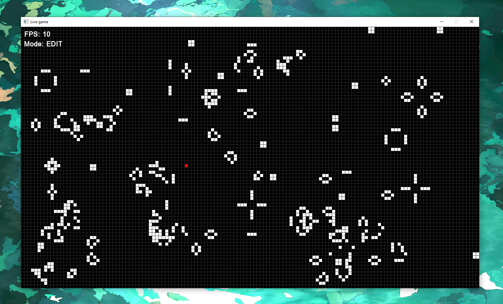

# 🕹️ GameLive

**GameLive** is a Windows desktop application for interactive simulation and editing with Conway’s Game of Life.

---

## 🛠️ Main Capabilities

- **Edit Mode** (`Q`): Instantly draw or erase cells on the grid.
- **Simulation Mode**: Classic Conway’s Life evolution, visualized in real time.
- **Player Mode** (`E`): Control a player on the board using `WASD`.
- **Dynamic FPS** (`1`–`9`): Change simulation speed from 5 to 45 FPS at any moment.

---

## 🎯 Usage Overview

- **Switch Modes:**
  - `Q` — Edit Mode
  - `E` — Player Mode
- **Move Player:**
  - `W`, `A`, `S`, `D`
- **Change FPS:**
  - Keys `1`–`9` (5, 10, ..., 45 FPS), `0` (unlimited)
- **Edit Cells:**
  - Left Mouse Button (in Edit Mode)
- **Place Player:**
  - Left Mouse Button (in Player Mode)

---

## 📦 Quick Start

### For Users

1. [Download the latest release](https://github.com/Mike-Flint/GameLive/releases)
2. Unzip the archive
3. Run `GameLive.exe`

### For Developers

```sh
git clone https://github.com/Mike-Flint/GameLive.git
cd GameLive
cmake -B Build -S . -G "Visual Studio 17 2022" -A x64
cmake --build Build --config Release
Build\Release\GameLive.exe
```

---

## 🖼️ Example


